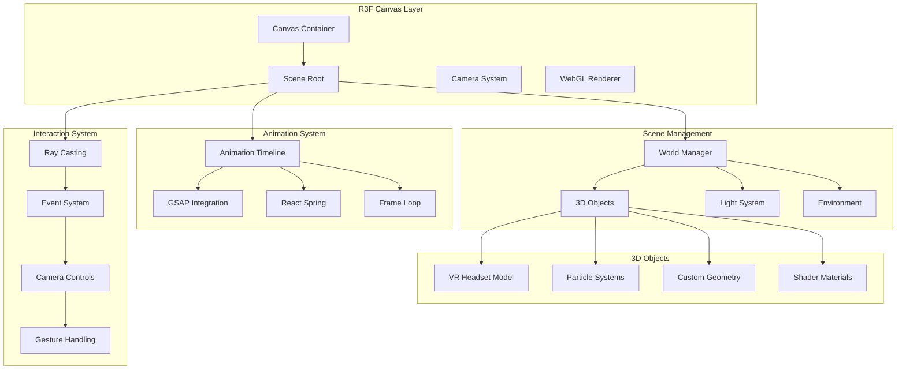

# 3D Architecture Specification

## 3D Scene Architecture Overview

The 3D architecture is built on React Three Fiber (R3F) with Three.js, providing an immersive experience while maintaining web performance standards.

## Core 3D Architecture



## Scene Structure

### 1. Canvas Configuration

```typescript
// Main canvas setup
interface SceneConfig {
  antialias: boolean
  alpha: boolean
  powerPreference: 'high-performance' | 'low-power' | 'default'
  shadows: boolean
  toneMapping: THREE.ToneMapping
  outputColorSpace: THREE.ColorSpace
}

const sceneConfig: SceneConfig = {
  antialias: true,
  alpha: true,
  powerPreference: 'high-performance',
  shadows: true,
  toneMapping: THREE.ACESFilmicToneMapping,
  outputColorSpace: THREE.SRGBColorSpace,
}

function Scene3D() {
  return (
    <Canvas
      {...sceneConfig}
      camera={{
        position: [0, 0, 5],
        fov: 75,
        near: 0.1,
        far: 1000,
      }}
      className="w-full h-full"
    >
      <SceneContent />
    </Canvas>
  )
}
```

### 2. Scene Hierarchy

```typescript
function SceneContent() {
  return (
    <>
      {/* Environment Setup */}
      <Environment />
      <Lighting />
      <Fog />
      
      {/* Main 3D Content */}
      <Suspense fallback={<LoadingPlaceholder />}>
        <WorldManager>
          <VRHeadsetModel />
          <MathematicalParticles />
          <InteractiveElements />
        </WorldManager>
      </Suspense>
      
      {/* Camera and Controls */}
      <CameraManager />
      <Controls />
      
      {/* Post Processing */}
      <PostProcessing />
      
      {/* Debug Tools (development only) */}
      {process.env.NODE_ENV === 'development' && <DebugTools />}
    </>
  )
}
```

## VR Headset Model Architecture

### 1. Model Structure

```typescript
interface VRHeadsetModelProps {
  position?: [number, number, number]
  rotation?: [number, number, number]
  scale?: number
  interactive?: boolean
  quality?: 'low' | 'medium' | 'high'
  animationSpeed?: number
}

function VRHeadsetModel({
  position = [0, 0, 0],
  rotation = [0, 0, 0],
  scale = 1,
  interactive = true,
  quality = 'medium',
  animationSpeed = 1,
}: VRHeadsetModelProps) {
  const groupRef = useRef<THREE.Group>(null)
  const { scene, materials, animations } = useGLTF('/models/vr-headset.glb')
  
  // Animation setup
  const { actions } = useAnimations(animations, groupRef)
  
  // Interaction setup
  const [hovered, setHovered] = useState(false)
  const [clicked, setClicked] = useState(false)
  
  return (
    <group
      ref={groupRef}
      position={position}
      rotation={rotation}
      scale={scale}
      onPointerOver={() => setHovered(true)}
      onPointerOut={() => setHovered(false)}
      onClick={() => setClicked(!clicked)}
    >
      <ModelGeometry scene={scene} materials={materials} />
      <ModelMaterials materials={materials} hovered={hovered} />
      <ModelAnimations actions={actions} speed={animationSpeed} />
    </group>
  )
}
```

### 2. Material System

```typescript
// Custom shader materials for VR headset
const vrHeadsetMaterial = new THREE.ShaderMaterial({
  vertexShader: `
    uniform float time;
    uniform float hoverIntensity;
    
    varying vec3 vPosition;
    varying vec3 vNormal;
    varying vec2 vUv;
    
    void main() {
      vPosition = position;
      vNormal = normal;
      vUv = uv;
      
      // Vertex displacement for hover effect
      vec3 pos = position;
      if (hoverIntensity > 0.0) {
        pos += normal * sin(time * 2.0 + position.y * 10.0) * hoverIntensity * 0.01;
      }
      
      gl_Position = projectionMatrix * modelViewMatrix * vec4(pos, 1.0);
    }
  `,
  
  fragmentShader: `
    uniform float time;
    uniform float hoverIntensity;
    uniform vec3 color;
    uniform float metalness;
    uniform float roughness;
    uniform float emission;
    
    varying vec3 vPosition;
    varying vec3 vNormal;
    varying vec2 vUv;
    
    void main() {
      // Base color with time-based variation
      vec3 baseColor = color;
      
      // Add hover glow effect
      if (hoverIntensity > 0.0) {
        float glow = sin(time * 3.0) * 0.5 + 0.5;
        baseColor += vec3(0.2, 0.4, 1.0) * glow * hoverIntensity;
      }
      
      // Surface details
      float fresnel = 1.0 - dot(normalize(vNormal), normalize(cameraPosition - vPosition));
      baseColor += vec3(0.1, 0.3, 0.8) * fresnel * 0.3;
      
      // Mathematical pattern overlay
      float pattern = sin(vUv.x * 20.0) * sin(vUv.y * 20.0) * 0.1;
      baseColor += pattern * vec3(0.0, 1.0, 1.0) * emission;
      
      gl_FragColor = vec4(baseColor, 1.0);
    }
  `,
  
  uniforms: {
    time: { value: 0 },
    hoverIntensity: { value: 0 },
    color: { value: new THREE.Color('#1a1a2e') },
    metalness: { value: 0.8 },
    roughness: { value: 0.2 },
    emission: { value: 0.1 },
  },
})

// Material animation hook
function useMaterialAnimation(material: THREE.ShaderMaterial) {
  useFrame((state) => {
    material.uniforms.time.value = state.clock.elapsedTime
  })
}
```

## Mathematical Particle System

### 1. GPU-Based Particle System

```typescript
interface MathematicalParticlesProps {
  count?: number
  formula?: 'wave' | 'spiral' | 'fractal' | 'lorenz'
  speed?: number
  size?: number
  color?: string
}

function MathematicalParticles({
  count = 1000,
  formula = 'wave',
  speed = 1,
  size = 0.02,
  color = '#00ff88',
}: MathematicalParticlesProps) {
  const meshRef = useRef<THREE.Points>(null)
  const materialRef = useRef<THREE.ShaderMaterial>(null)
  
  // Generate initial positions based on mathematical formula
  const positions = useMemo(() => {
    const positions = new Float32Array(count * 3)
    
    for (let i = 0; i < count; i++) {
      const t = i / count
      let [x, y, z] = [0, 0, 0]
      
      switch (formula) {
        case 'wave':
          x = (t - 0.5) * 10
          y = Math.sin(t * Math.PI * 4) * 2
          z = Math.cos(t * Math.PI * 2) * 1
          break
          
        case 'spiral':
          const angle = t * Math.PI * 8
          const radius = t * 3
          x = Math.cos(angle) * radius
          y = (t - 0.5) * 4
          z = Math.sin(angle) * radius
          break
          
        case 'fractal':
          // Sierpinski triangle in 3D
          x = Math.cos(t * Math.PI * 6) * (1 - t) * 3
          y = Math.sin(t * Math.PI * 6) * (1 - t) * 3
          z = (t - 0.5) * 2
          break
          
        case 'lorenz':
          // Lorenz attractor approximation
          const sigma = 10, rho = 28, beta = 8/3
          x = sigma * (y - x) * t
          y = x * (rho - z) - y * t
          z = x * y - beta * z * t
          break
      }
      
      positions[i * 3] = x
      positions[i * 3 + 1] = y
      positions[i * 3 + 2] = z
    }
    
    return positions
  }, [count, formula])
  
  // Particle shader material
  const particleMaterial = useMemo(() => new THREE.ShaderMaterial({
    vertexShader: `
      uniform float time;
      uniform float speed;
      uniform float size;
      
      varying vec3 vColor;
      
      void main() {
        vec3 pos = position;
        
        // Animated movement based on formula
        pos.y += sin(time * speed + position.x * 0.5) * 0.5;
        pos.x += cos(time * speed * 0.7 + position.z * 0.3) * 0.3;
        
        vColor = vec3(
          0.5 + 0.5 * sin(time + position.x),
          0.5 + 0.5 * cos(time + position.y),
          0.8
        );
        
        vec4 mvPosition = modelViewMatrix * vec4(pos, 1.0);
        gl_PointSize = size * (300.0 / -mvPosition.z);
        gl_Position = projectionMatrix * mvPosition;
      }
    `,
    
    fragmentShader: `
      varying vec3 vColor;
      
      void main() {
        float r = length(gl_PointCoord - vec2(0.5));
        if (r > 0.5) discard;
        
        float alpha = 1.0 - r * 2.0;
        gl_FragColor = vec4(vColor, alpha);
      }
    `,
    
    uniforms: {
      time: { value: 0 },
      speed: { value: speed },
      size: { value: size * 100 },
    },
    
    transparent: true,
    blending: THREE.AdditiveBlending,
    depthWrite: false,
  }), [speed, size])
  
  // Animation loop
  useFrame((state) => {
    if (materialRef.current) {
      materialRef.current.uniforms.time.value = state.clock.elapsedTime
    }
  })
  
  return (
    <points ref={meshRef}>
      <bufferGeometry>
        <bufferAttribute
          attach="attributes-position"
          count={count}
          array={positions}
          itemSize={3}
        />
      </bufferGeometry>
      <primitive object={particleMaterial} ref={materialRef} />
    </points>
  )
}
```

## Camera System Architecture

### 1. Adaptive Camera Control

```typescript
interface CameraManagerProps {
  autoRotate?: boolean
  enableZoom?: boolean
  enablePan?: boolean
  minDistance?: number
  maxDistance?: number
}

function CameraManager({
  autoRotate = true,
  enableZoom = true,
  enablePan = false,
  minDistance = 2,
  maxDistance = 20,
}: CameraManagerProps) {
  const { camera, gl } = useThree()
  const controlsRef = useRef<OrbitControlsImpl>(null)
  const { isMobile } = useViewport()
  
  // Responsive camera settings
  useEffect(() => {
    if (camera instanceof THREE.PerspectiveCamera) {
      if (isMobile) {
        camera.fov = 85
        camera.position.set(0, 0, 8)
      } else {
        camera.fov = 75
        camera.position.set(0, 0, 5)
      }
      camera.updateProjectionMatrix()
    }
  }, [camera, isMobile])
  
  // Auto-rotation based on scroll
  const { scrollY } = useScroll()
  
  useFrame(() => {
    if (controlsRef.current && autoRotate) {
      controlsRef.current.azimuthAngle += 0.005 * (1 - scrollY)
    }
  })
  
  return (
    <OrbitControls
      ref={controlsRef}
      enableZoom={enableZoom}
      enablePan={enablePan}
      minDistance={minDistance}
      maxDistance={maxDistance}
      maxPolarAngle={Math.PI / 2}
      minPolarAngle={Math.PI / 4}
      autoRotate={autoRotate}
      autoRotateSpeed={0.5}
    />
  )
}
```

### 2. Scene Transitions

```typescript
// Camera animation system
function useCameraTransitions() {
  const { camera } = useThree()
  
  const animateToPosition = useCallback((
    position: [number, number, number],
    target: [number, number, number],
    duration: number = 2
  ) => {
    gsap.to(camera.position, {
      x: position[0],
      y: position[1],
      z: position[2],
      duration,
      ease: "power2.inOut",
    })
    
    if (camera instanceof THREE.PerspectiveCamera) {
      gsap.to(camera.lookAt, {
        x: target[0],
        y: target[1],
        z: target[2],
        duration,
        ease: "power2.inOut",
        onUpdate: () => camera.lookAt(...target),
      })
    }
  }, [camera])
  
  return { animateToPosition }
}

// Section-based camera positions
const cameraPositions = {
  hero: { position: [0, 0, 5], target: [0, 0, 0] },
  about: { position: [-3, 2, 4], target: [0, 0, 0] },
  projects: { position: [3, -1, 6], target: [0, 0, 0] },
  contact: { position: [0, 3, 8], target: [0, 0, 0] },
}
```

## Lighting System

### 1. Dynamic Lighting Setup

```typescript
function Lighting() {
  const { theme } = useThemeStore()
  const lightRef = useRef<THREE.DirectionalLight>(null)
  
  // Theme-based lighting
  const lightConfig = useMemo(() => ({
    light: {
      intensity: theme === 'dark' ? 0.8 : 1.2,
      color: theme === 'dark' ? '#4A90E2' : '#F5A623',
    },
    ambient: {
      intensity: theme === 'dark' ? 0.3 : 0.5,
      color: theme === 'dark' ? '#2C3E50' : '#ECF0F1',
    },
  }), [theme])
  
  // Animate light intensity
  useFrame((state) => {
    if (lightRef.current) {
      const pulse = Math.sin(state.clock.elapsedTime * 0.5) * 0.1 + 0.9
      lightRef.current.intensity = lightConfig.light.intensity * pulse
    }
  })
  
  return (
    <>
      {/* Main directional light */}
      <directionalLight
        ref={lightRef}
        position={[10, 10, 5]}
        intensity={lightConfig.light.intensity}
        color={lightConfig.light.color}
        castShadow
        shadow-mapSize-width={2048}
        shadow-mapSize-height={2048}
        shadow-camera-far={50}
        shadow-camera-left={-10}
        shadow-camera-right={10}
        shadow-camera-top={10}
        shadow-camera-bottom={-10}
      />
      
      {/* Ambient lighting */}
      <ambientLight
        intensity={lightConfig.ambient.intensity}
        color={lightConfig.ambient.color}
      />
      
      {/* Accent lights */}
      <pointLight
        position={[-5, 5, -5]}
        intensity={0.5}
        color="#FF6B6B"
      />
      
      <pointLight
        position={[5, -5, 5]}
        intensity={0.5}
        color="#4ECDC4"
      />
      
      {/* Hemisphere light for natural ambient */}
      <hemisphereLight
        args={['#87CEEB', '#98FB98', 0.4]}
      />
    </>
  )
}
```

## Performance Optimization

### 1. Level of Detail (LOD) System

```typescript
function LODManager({ children }: { children: React.ReactNode }) {
  const { camera } = useThree()
  const [lodLevel, setLodLevel] = useState<'high' | 'medium' | 'low'>('high')
  
  useFrame(() => {
    const distance = camera.position.length()
    
    if (distance < 5) {
      setLodLevel('high')
    } else if (distance < 15) {
      setLodLevel('medium')
    } else {
      setLodLevel('low')
    }
  })
  
  return (
    <LODContext.Provider value={{ lodLevel }}>
      {children}
    </LODContext.Provider>
  )
}

// LOD-aware component
function VRHeadsetLOD() {
  const { lodLevel } = useLOD()
  
  const modelPath = useMemo(() => {
    switch (lodLevel) {
      case 'high': return '/models/vr-headset-high.glb'
      case 'medium': return '/models/vr-headset-medium.glb'
      case 'low': return '/models/vr-headset-low.glb'
      default: return '/models/vr-headset-medium.glb'
    }
  }, [lodLevel])
  
  return (
    <Suspense fallback={<LODPlaceholder />}>
      <VRHeadsetModel modelPath={modelPath} />
    </Suspense>
  )
}
```

### 2. Frustum Culling

```typescript
function FrustumCulling({ children }: { children: React.ReactNode }) {
  const { camera } = useThree()
  const frustum = useMemo(() => new THREE.Frustum(), [])
  const matrix = useMemo(() => new THREE.Matrix4(), [])
  
  const culledChildren = useMemo(() => {
    matrix.multiplyMatrices(camera.projectionMatrix, camera.matrixWorldInverse)
    frustum.setFromProjectionMatrix(matrix)
    
    return React.Children.map(children, (child) => {
      if (React.isValidElement(child) && child.props.position) {
        const position = new THREE.Vector3(...child.props.position)
        if (!frustum.containsPoint(position)) {
          return null // Cull object outside frustum
        }
      }
      return child
    })
  }, [children, frustum, matrix, camera])
  
  return <>{culledChildren}</>
}
```

### 3. Instancing for Particles

```typescript
function InstancedParticles({ count = 1000 }: { count?: number }) {
  const meshRef = useRef<THREE.InstancedMesh>(null)
  const dummy = useMemo(() => new THREE.Object3D(), [])
  
  // Setup instances
  useLayoutEffect(() => {
    if (meshRef.current) {
      for (let i = 0; i < count; i++) {
        dummy.position.set(
          (Math.random() - 0.5) * 20,
          (Math.random() - 0.5) * 20,
          (Math.random() - 0.5) * 20
        )
        dummy.rotation.set(
          Math.random() * Math.PI,
          Math.random() * Math.PI,
          Math.random() * Math.PI
        )
        dummy.updateMatrix()
        meshRef.current.setMatrixAt(i, dummy.matrix)
      }
      meshRef.current.instanceMatrix.needsUpdate = true
    }
  }, [count, dummy])
  
  // Animate instances
  useFrame((state) => {
    if (meshRef.current) {
      for (let i = 0; i < count; i++) {
        meshRef.current.getMatrixAt(i, dummy.matrix)
        dummy.matrix.decompose(dummy.position, dummy.quaternion, dummy.scale)
        
        dummy.rotation.x += 0.01
        dummy.rotation.y += 0.01
        dummy.updateMatrix()
        
        meshRef.current.setMatrixAt(i, dummy.matrix)
      }
      meshRef.current.instanceMatrix.needsUpdate = true
    }
  })
  
  return (
    <instancedMesh ref={meshRef} args={[undefined, undefined, count]}>
      <boxGeometry args={[0.1, 0.1, 0.1]} />
      <meshStandardMaterial color="#00ff88" />
    </instancedMesh>
  )
}
```

This 3D architecture provides a comprehensive foundation for creating immersive, performant 3D experiences in the web portfolio while maintaining scalability and optimization across all devices.