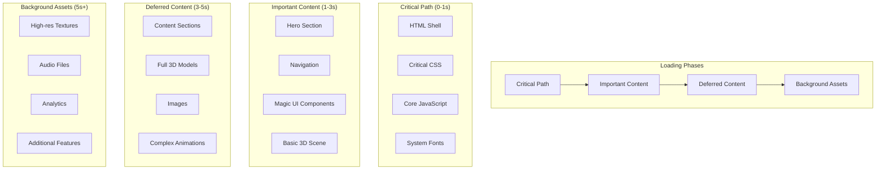

# Performance Architecture Specification

## Performance Strategy Overview

The performance architecture is designed to achieve 60fps on desktop and 30fps on mobile while maintaining excellent user experience across all devices and network conditions.

## Performance Targets

### Primary Metrics
- **Desktop**: 60 FPS, < 3s initial load, < 1s navigation
- **Mobile**: 30 FPS, < 5s initial load, < 2s navigation
- **Core Web Vitals**:
  - Largest Contentful Paint (LCP): < 2.5s
  - First Input Delay (FID): < 100ms
  - Cumulative Layout Shift (CLS): < 0.1
- **Bundle Size**: < 1MB initial, < 2MB total
- **Memory Usage**: < 100MB on mobile, < 200MB on desktop

### Secondary Metrics
- Time to Interactive (TTI): < 4s
- Speed Index: < 3s
- Total Blocking Time (TBT): < 200ms

## Loading Strategy Architecture



## Asset Optimization Strategy

### 1. Image Optimization

```typescript
// Image optimization configuration
const imageConfig = {
  domains: ['cdn.portfolio.com'],
  formats: ['image/webp', 'image/avif'],
  deviceSizes: [640, 750, 828, 1080, 1200, 1920, 2048, 3840],
  imageSizes: [16, 32, 48, 64, 96, 128, 256, 384],
  minimumCacheTTL: 31536000, // 1 year
}

// Responsive image component
interface OptimizedImageProps {
  src: string
  alt: string
  width: number
  height: number
  priority?: boolean
  quality?: number
  placeholder?: 'blur' | 'empty'
  blurDataURL?: string
}

function OptimizedImage({
  src,
  alt,
  width,
  height,
  priority = false,
  quality = 75,
  placeholder = 'blur',
  blurDataURL,
}: OptimizedImageProps) {
  return (
    <Image
      src={src}
      alt={alt}
      width={width}
      height={height}
      priority={priority}
      quality={quality}
      placeholder={placeholder}
      blurDataURL={blurDataURL}
      sizes="(max-width: 768px) 100vw, (max-width: 1200px) 50vw, 33vw"
      style={{
        objectFit: 'cover',
        objectPosition: 'center',
      }}
    />
  )
}
```

### 2. 3D Asset Optimization

```typescript
// 3D model loading strategy
interface ModelLoadingConfig {
  lod: 'low' | 'medium' | 'high'
  compression: 'draco' | 'meshopt' | 'none'
  format: 'glb' | 'gltf'
  maxFileSize: number
}

const modelConfigs = {
  mobile: {
    lod: 'low' as const,
    compression: 'draco' as const,
    format: 'glb' as const,
    maxFileSize: 500000, // 500KB
  },
  tablet: {
    lod: 'medium' as const,
    compression: 'draco' as const,
    format: 'glb' as const,
    maxFileSize: 1000000, // 1MB
  },
  desktop: {
    lod: 'high' as const,
    compression: 'meshopt' as const,
    format: 'gltf' as const,
    maxFileSize: 2000000, // 2MB
  },
}

// Progressive model loading
function useProgressiveModel(basePath: string) {
  const { isMobile, isTablet } = useViewport()
  const [currentModel, setCurrentModel] = useState<string | null>(null)
  
  useEffect(() => {
    const config = isMobile ? modelConfigs.mobile : 
                   isTablet ? modelConfigs.tablet : 
                   modelConfigs.desktop
    
    const loadModel = async () => {
      // Load low-quality first
      const lowQualityPath = `${basePath}-low.${config.format}`
      setCurrentModel(lowQualityPath)
      
      // Preload higher quality in background
      if (!isMobile) {
        const highQualityPath = `${basePath}-high.${config.format}`
        try {
          await preloadModel(highQualityPath)
          setCurrentModel(highQualityPath)
        } catch (error) {
          console.warn('Failed to load high-quality model:', error)
        }
      }
    }
    
    loadModel()
  }, [basePath, isMobile, isTablet])
  
  return currentModel
}

// Model preloading utility
async function preloadModel(path: string): Promise<void> {
  return new Promise((resolve, reject) => {
    const loader = new GLTFLoader()
    loader.load(
      path,
      () => resolve(),
      undefined,
      (error) => reject(error)
    )
  })
}
```

### 3. Texture Optimization

```typescript
// Texture loading and compression
class TextureManager {
  private cache = new Map<string, THREE.Texture>()
  private loadingPromises = new Map<string, Promise<THREE.Texture>>()
  
  async loadTexture(
    url: string,
    options: {
      format?: THREE.PixelFormat
      type?: THREE.TextureDataType
      generateMipmaps?: boolean
      flipY?: boolean
    } = {}
  ): Promise<THREE.Texture> {
    // Check cache first
    if (this.cache.has(url)) {
      return this.cache.get(url)!
    }
    
    // Check if already loading
    if (this.loadingPromises.has(url)) {
      return this.loadingPromises.get(url)!
    }
    
    // Load texture
    const loadPromise = new Promise<THREE.Texture>((resolve, reject) => {
      const loader = new THREE.TextureLoader()
      loader.load(
        url,
        (texture) => {
          // Apply optimizations
          texture.format = options.format ?? THREE.RGBAFormat
          texture.type = options.type ?? THREE.UnsignedByteType
          texture.generateMipmaps = options.generateMipmaps ?? true
          texture.flipY = options.flipY ?? false
          
          // Enable compression if available
          const extension = renderer.extensions.get('WEBGL_compressed_texture_s3tc')
          if (extension) {
            texture.format = THREE.RGB_S3TC_DXT1_Format
          }
          
          this.cache.set(url, texture)
          this.loadingPromises.delete(url)
          resolve(texture)
        },
        undefined,
        (error) => {
          this.loadingPromises.delete(url)
          reject(error)
        }
      )
    })
    
    this.loadingPromises.set(url, loadPromise)
    return loadPromise
  }
  
  preloadTextures(urls: string[]): Promise<THREE.Texture[]> {
    return Promise.all(urls.map(url => this.loadTexture(url)))
  }
  
  dispose(): void {
    this.cache.forEach(texture => texture.dispose())
    this.cache.clear()
    this.loadingPromises.clear()
  }
}

const textureManager = new TextureManager()
```

## Code Splitting Strategy

### 1. Route-Based Code Splitting

```typescript
// Dynamic imports for routes
const HomePage = lazy(() => import('@/app/page'))
const AboutPage = lazy(() => import('@/app/about/page'))
const ProjectsPage = lazy(() => import('@/app/projects/page'))
const ContactPage = lazy(() => import('@/app/contact/page'))

// Component-based code splitting
const Scene3D = lazy(() => 
  import('@/components/3d/Scene3D').then(module => ({ 
    default: module.Scene3D 
  }))
)

const MagicUIComponents = lazy(() => 
  import('@/components/ui/magic-ui').then(module => ({
    default: module.MagicUIComponents
  }))
)

// Feature-based code splitting
const ProjectViewer = lazy(() =>
  import('@/features/project-viewer').then(module => ({
    default: module.ProjectViewer
  }))
)
```

### 2. Vendor Code Splitting

```typescript
// webpack configuration for vendor splitting
const webpackConfig = {
  optimization: {
    splitChunks: {
      chunks: 'all',
      cacheGroups: {
        // React and related libraries
        react: {
          test: /[\\/]node_modules[\\/](react|react-dom)[\\/]/,
          name: 'react',
          chunks: 'all',
          priority: 20,
        },
        
        // Three.js and 3D libraries
        threejs: {
          test: /[\\/]node_modules[\\/](three|@react-three)[\\/]/,
          name: 'threejs',
          chunks: 'all',
          priority: 15,
        },
        
        // Magic UI and animation libraries
        animations: {
          test: /[\\/]node_modules[\\/](framer-motion|@magic-ui|gsap)[\\/]/,
          name: 'animations',
          chunks: 'all',
          priority: 10,
        },
        
        // Other vendor libraries
        vendor: {
          test: /[\\/]node_modules[\\/]/,
          name: 'vendors',
          chunks: 'all',
          priority: 5,
        },
      },
    },
  },
}
```

## Memory Management

### 1. 3D Memory Management

```typescript
class MemoryManager {
  private disposables = new Set<THREE.Object3D | THREE.Material | THREE.Texture>()
  private memoryUsage = 0
  private readonly maxMemoryMB = typeof window !== 'undefined' && 
    /Mobile|Android|iOS/.test(navigator.userAgent) ? 100 : 200
  
  track<T extends THREE.Object3D | THREE.Material | THREE.Texture>(object: T): T {
    this.disposables.add(object)
    
    if (object instanceof THREE.Texture) {
      this.memoryUsage += this.calculateTextureSize(object)
    } else if (object instanceof THREE.BufferGeometry) {
      this.memoryUsage += this.calculateGeometrySize(object)
    }
    
    this.checkMemoryUsage()
    return object
  }
  
  dispose(object: THREE.Object3D | THREE.Material | THREE.Texture): void {
    if (this.disposables.has(object)) {
      if ('dispose' in object) {
        object.dispose()
      }
      this.disposables.delete(object)
    }
  }
  
  disposeAll(): void {
    this.disposables.forEach(object => {
      if ('dispose' in object) {
        object.dispose()
      }
    })
    this.disposables.clear()
    this.memoryUsage = 0
  }
  
  private calculateTextureSize(texture: THREE.Texture): number {
    const { width, height } = texture.image || { width: 1024, height: 1024 }
    const bytesPerPixel = 4 // RGBA
    return (width * height * bytesPerPixel) / (1024 * 1024) // MB
  }
  
  private calculateGeometrySize(geometry: THREE.BufferGeometry): number {
    let size = 0
    Object.values(geometry.attributes).forEach(attribute => {
      size += attribute.array.byteLength
    })
    return size / (1024 * 1024) // MB
  }
  
  private checkMemoryUsage(): void {
    if (this.memoryUsage > this.maxMemoryMB * 0.8) {
      console.warn(`Memory usage approaching limit: ${this.memoryUsage.toFixed(2)}MB`)
      this.cleanup()
    }
  }
  
  private cleanup(): void {
    // Implement LRU cleanup strategy
    const sortedObjects = Array.from(this.disposables).sort((a, b) => {
      // Sort by last used time (would need to track this)
      return 0 // Placeholder
    })
    
    // Dispose of least recently used objects
    const toDispose = sortedObjects.slice(0, Math.floor(sortedObjects.length * 0.2))
    toDispose.forEach(object => this.dispose(object))
  }
  
  getMemoryUsage(): { current: number; max: number; percentage: number } {
    return {
      current: this.memoryUsage,
      max: this.maxMemoryMB,
      percentage: (this.memoryUsage / this.maxMemoryMB) * 100,
    }
  }
}

const memoryManager = new MemoryManager()
```

### 2. React Memory Management

```typescript
// Memory-efficient component patterns
function useCleanupEffect(cleanup: () => void, deps: React.DependencyList) {
  useEffect(() => {
    return cleanup
  }, deps)
}

// Virtualized list for large datasets
function VirtualizedProjectList({ projects }: { projects: Project[] }) {
  const [startIndex, setStartIndex] = useState(0)
  const [endIndex, setEndIndex] = useState(10)
  const containerRef = useRef<HTMLDivElement>(null)
  
  const visibleProjects = useMemo(() => {
    return projects.slice(startIndex, endIndex)
  }, [projects, startIndex, endIndex])
  
  const handleScroll = useCallback(
    throttle((event: Event) => {
      const container = event.target as HTMLDivElement
      const scrollTop = container.scrollTop
      const itemHeight = 200 // Fixed item height
      const containerHeight = container.clientHeight
      
      const newStartIndex = Math.floor(scrollTop / itemHeight)
      const visibleCount = Math.ceil(containerHeight / itemHeight)
      const newEndIndex = Math.min(
        newStartIndex + visibleCount + 5, // Buffer
        projects.length
      )
      
      setStartIndex(newStartIndex)
      setEndIndex(newEndIndex)
    }, 100),
    [projects.length]
  )
  
  useEffect(() => {
    const container = containerRef.current
    if (container) {
      container.addEventListener('scroll', handleScroll)
      return () => container.removeEventListener('scroll', handleScroll)
    }
  }, [handleScroll])
  
  return (
    <div
      ref={containerRef}
      className="h-full overflow-auto"
      style={{ height: projects.length * 200 }}
    >
      <div style={{ paddingTop: startIndex * 200 }}>
        {visibleProjects.map((project, index) => (
          <ProjectCard
            key={project.id}
            project={project}
            style={{ height: 200 }}
          />
        ))}
      </div>
    </div>
  )
}
```

## Performance Monitoring

### 1. Real-time Performance Tracking

```typescript
interface PerformanceMetrics {
  fps: number
  memoryUsage: number
  drawCalls: number
  triangles: number
  loadTime: number
  interactionLatency: number
}

class PerformanceMonitor {
  private metrics: PerformanceMetrics = {
    fps: 0,
    memoryUsage: 0,
    drawCalls: 0,
    triangles: 0,
    loadTime: 0,
    interactionLatency: 0,
  }
  
  private lastFrameTime = 0
  private frameCount = 0
  private lastFPSUpdate = 0
  
  update(renderer: THREE.WebGLRenderer, scene: THREE.Scene): void {
    const now = performance.now()
    
    // FPS calculation
    this.frameCount++
    if (now - this.lastFPSUpdate >= 1000) {
      this.metrics.fps = this.frameCount
      this.frameCount = 0
      this.lastFPSUpdate = now
    }
    
    // Memory usage
    if ('memory' in performance) {
      this.metrics.memoryUsage = (performance as any).memory.usedJSHeapSize / (1024 * 1024)
    }
    
    // Render statistics
    const info = renderer.info
    this.metrics.drawCalls = info.render.calls
    this.metrics.triangles = info.render.triangles
    
    this.lastFrameTime = now
  }
  
  measureInteractionLatency(callback: () => void): void {
    const start = performance.now()
    
    requestAnimationFrame(() => {
      callback()
      requestAnimationFrame(() => {
        const end = performance.now()
        this.metrics.interactionLatency = end - start
      })
    })
  }
  
  getMetrics(): PerformanceMetrics {
    return { ...this.metrics }
  }
  
  getPerformanceGrade(): 'A' | 'B' | 'C' | 'D' | 'F' {
    const { fps, memoryUsage, interactionLatency } = this.metrics
    
    if (fps >= 55 && memoryUsage < 100 && interactionLatency < 16) return 'A'
    if (fps >= 45 && memoryUsage < 150 && interactionLatency < 33) return 'B'
    if (fps >= 30 && memoryUsage < 200 && interactionLatency < 50) return 'C'
    if (fps >= 20 && memoryUsage < 300 && interactionLatency < 100) return 'D'
    return 'F'
  }
}

// React hook for performance monitoring
function usePerformanceMonitor() {
  const [monitor] = useState(() => new PerformanceMonitor())
  const [metrics, setMetrics] = useState<PerformanceMetrics | null>(null)
  const { gl, scene } = useThree()
  
  useFrame(() => {
    monitor.update(gl, scene)
    
    // Update metrics every 60 frames (roughly once per second at 60fps)
    if (Math.random() < 1/60) {
      setMetrics(monitor.getMetrics())
    }
  })
  
  return { metrics, monitor }
}
```

### 2. Performance Budgets and Warnings

```typescript
interface PerformanceBudgets {
  maxBundleSize: number // bytes
  maxImageSize: number // bytes
  maxModelSize: number // bytes
  maxMemoryUsage: number // MB
  minFPS: number
  maxLoadTime: number // ms
}

const performanceBudgets: PerformanceBudgets = {
  maxBundleSize: 1024 * 1024, // 1MB
  maxImageSize: 500 * 1024, // 500KB
  maxModelSize: 2 * 1024 * 1024, // 2MB
  maxMemoryUsage: 200, // 200MB
  minFPS: 30,
  maxLoadTime: 5000, // 5s
}

class PerformanceBudgetMonitor {
  private warnings: string[] = []
  
  checkBundleSize(size: number): void {
    if (size > performanceBudgets.maxBundleSize) {
      this.warnings.push(`Bundle size ${(size / 1024 / 1024).toFixed(2)}MB exceeds budget`)
    }
  }
  
  checkImageSize(url: string, size: number): void {
    if (size > performanceBudgets.maxImageSize) {
      this.warnings.push(`Image ${url} size ${(size / 1024).toFixed(2)}KB exceeds budget`)
    }
  }
  
  checkModelSize(url: string, size: number): void {
    if (size > performanceBudgets.maxModelSize) {
      this.warnings.push(`Model ${url} size ${(size / 1024 / 1024).toFixed(2)}MB exceeds budget`)
    }
  }
  
  checkRuntime(metrics: PerformanceMetrics): void {
    if (metrics.fps < performanceBudgets.minFPS) {
      this.warnings.push(`FPS ${metrics.fps} below minimum ${performanceBudgets.minFPS}`)
    }
    
    if (metrics.memoryUsage > performanceBudgets.maxMemoryUsage) {
      this.warnings.push(`Memory usage ${metrics.memoryUsage.toFixed(2)}MB exceeds budget`)
    }
  }
  
  getWarnings(): string[] {
    return [...this.warnings]
  }
  
  clearWarnings(): void {
    this.warnings = []
  }
}

const budgetMonitor = new PerformanceBudgetMonitor()
```

## Adaptive Performance System

### 1. Quality Adjustment

```typescript
interface QualitySettings {
  shadows: boolean
  antialiasing: boolean
  postProcessing: boolean
  particleCount: number
  textureQuality: 'low' | 'medium' | 'high'
  modelLOD: 'low' | 'medium' | 'high'
}

class AdaptiveQualityManager {
  private currentSettings: QualitySettings
  private baseSettings: QualitySettings
  private performanceHistory: number[] = []
  
  constructor() {
    this.baseSettings = {
      shadows: true,
      antialiasing: true,
      postProcessing: true,
      particleCount: 1000,
      textureQuality: 'high',
      modelLOD: 'high',
    }
    
    this.currentSettings = { ...this.baseSettings }
  }
  
  updateSettings(fps: number): QualitySettings {
    this.performanceHistory.push(fps)
    
    // Keep only last 60 frames
    if (this.performanceHistory.length > 60) {
      this.performanceHistory.shift()
    }
    
    const averageFPS = this.performanceHistory.reduce((a, b) => a + b, 0) / this.performanceHistory.length
    
    if (averageFPS < 25) {
      // Very low performance - minimal settings
      this.currentSettings = {
        shadows: false,
        antialiasing: false,
        postProcessing: false,
        particleCount: 100,
        textureQuality: 'low',
        modelLOD: 'low',
      }
    } else if (averageFPS < 40) {
      // Low performance - reduced settings
      this.currentSettings = {
        shadows: false,
        antialiasing: true,
        postProcessing: false,
        particleCount: 300,
        textureQuality: 'medium',
        modelLOD: 'medium',
      }
    } else if (averageFPS > 50) {
      // Good performance - restore settings
      this.currentSettings = { ...this.baseSettings }
    }
    
    return { ...this.currentSettings }
  }
  
  getSettings(): QualitySettings {
    return { ...this.currentSettings }
  }
  
  reset(): void {
    this.currentSettings = { ...this.baseSettings }
    this.performanceHistory = []
  }
}

// React hook for adaptive quality
function useAdaptiveQuality() {
  const [qualityManager] = useState(() => new AdaptiveQualityManager())
  const [settings, setSettings] = useState<QualitySettings>(qualityManager.getSettings())
  const { metrics } = usePerformanceMonitor()
  
  useEffect(() => {
    if (metrics) {
      const newSettings = qualityManager.updateSettings(metrics.fps)
      setSettings(newSettings)
    }
  }, [metrics, qualityManager])
  
  return settings
}
```

### 2. Network-Aware Loading

```typescript
class NetworkAwareLoader {
  private connection: any
  private loadingStrategy: 'aggressive' | 'balanced' | 'conservative'
  
  constructor() {
    this.connection = (navigator as any).connection
    this.updateStrategy()
    
    // Listen for network changes
    if (this.connection) {
      this.connection.addEventListener('change', () => {
        this.updateStrategy()
      })
    }
  }
  
  private updateStrategy(): void {
    if (!this.connection) {
      this.loadingStrategy = 'balanced'
      return
    }
    
    const { effectiveType, downlink } = this.connection
    
    if (effectiveType === '4g' && downlink > 2) {
      this.loadingStrategy = 'aggressive'
    } else if (effectiveType === '3g' || downlink < 1) {
      this.loadingStrategy = 'conservative'
    } else {
      this.loadingStrategy = 'balanced'
    }
  }
  
  shouldPreload(assetType: 'image' | 'model' | 'texture'): boolean {
    switch (this.loadingStrategy) {
      case 'aggressive':
        return true
      case 'balanced':
        return assetType !== 'texture'
      case 'conservative':
        return assetType === 'image'
      default:
        return false
    }
  }
  
  getPreloadPriority(assetType: 'image' | 'model' | 'texture'): 'high' | 'low' {
    if (this.loadingStrategy === 'aggressive') return 'high'
    if (this.loadingStrategy === 'conservative') return 'low'
    return assetType === 'image' ? 'high' : 'low'
  }
  
  getQualityLevel(): 'low' | 'medium' | 'high' {
    switch (this.loadingStrategy) {
      case 'aggressive': return 'high'
      case 'balanced': return 'medium'
      case 'conservative': return 'low'
      default: return 'medium'
    }
  }
}

const networkLoader = new NetworkAwareLoader()
```

This performance architecture ensures optimal loading and runtime performance across all devices and network conditions while maintaining the visual quality and interactivity of the portfolio.