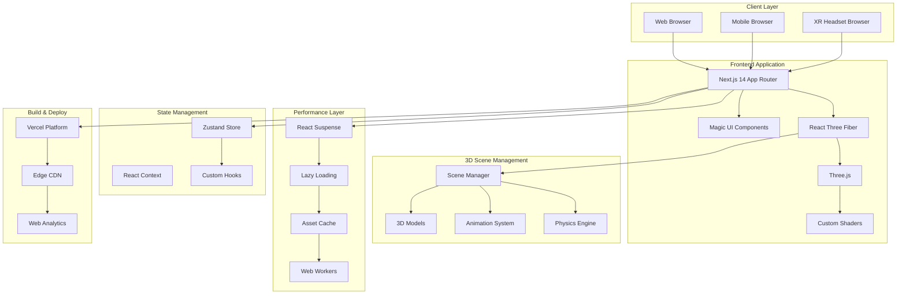
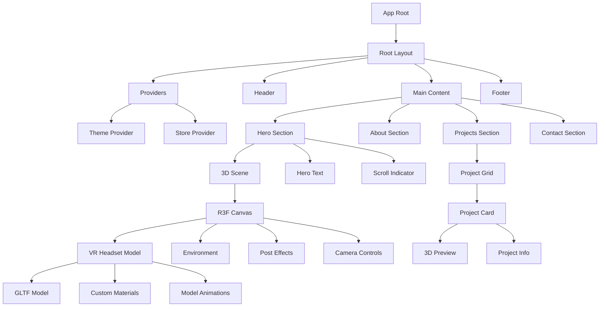
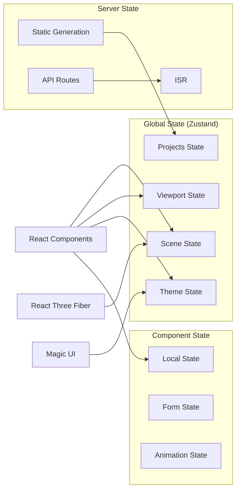
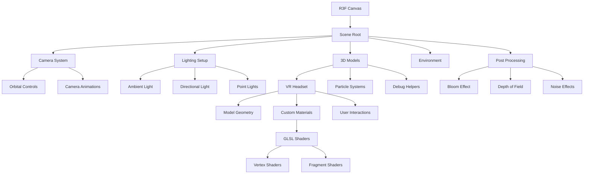
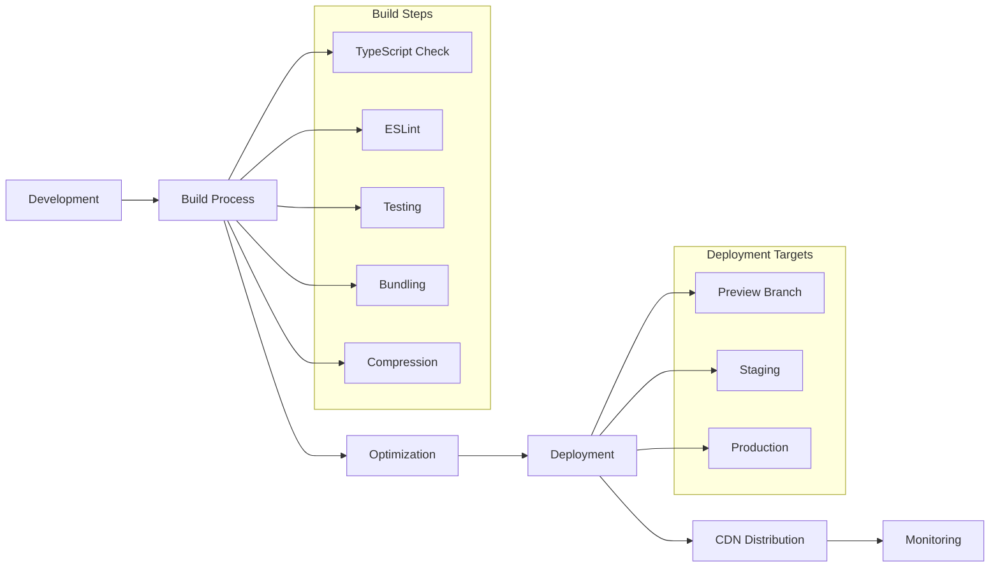
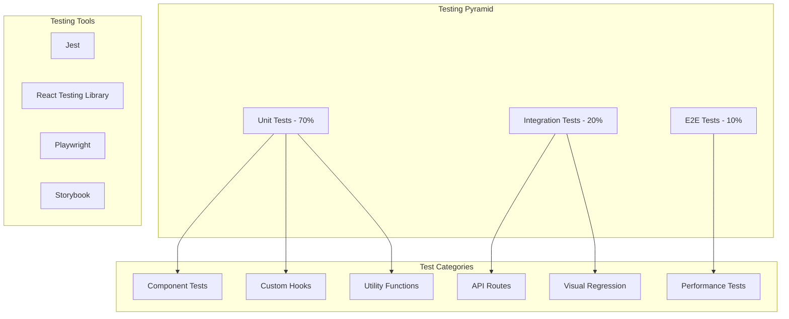

# XR Developer Portfolio - System Architecture

## 1. High-Level Architecture Overview



## 2. Technology Stack

### Core Framework
- **Next.js 14**: App Router, Server Components, Static Generation
- **React 18**: Concurrent Features, Suspense, Error Boundaries
- **TypeScript**: Type safety and developer experience

### UI & Styling
- **Magic UI**: Pre-built animated components
- **Tailwind CSS**: Utility-first styling
- **Framer Motion**: Advanced animations
- **Lucide Icons**: Icon system

### 3D Graphics
- **React Three Fiber**: React renderer for Three.js
- **Three.js**: 3D graphics library
- **@react-three/drei**: Useful helpers and abstractions
- **@react-three/postprocessing**: Post-processing effects
- **Custom GLSL Shaders**: Mathematical and visual effects

### State Management
- **Zustand**: Lightweight state management
- **React Context**: Component-level state
- **Custom Hooks**: Reusable stateful logic

### Performance
- **React Suspense**: Code splitting and loading states
- **Next.js Image**: Optimized image loading
- **Web Workers**: Heavy computation offloading
- **Asset Streaming**: Progressive model loading

### Development & Testing
- **ESLint**: Code linting
- **Prettier**: Code formatting
- **Jest**: Unit testing
- **Playwright**: E2E testing
- **Storybook**: Component development

### Deployment
- **Vercel**: Hosting and deployment
- **Edge Functions**: Serverless API endpoints
- **CDN**: Global content delivery
- **Analytics**: Performance monitoring

## 3. Project Structure

```
portfolio/
├── public/                 # Static assets
│   ├── models/            # 3D models (GLTF/GLB)
│   ├── textures/          # Texture files
│   ├── audio/             # Audio files
│   └── icons/             # Favicon and app icons
├── src/
│   ├── app/               # Next.js App Router
│   │   ├── (routes)/      # Route groups
│   │   ├── globals.css    # Global styles
│   │   ├── layout.tsx     # Root layout
│   │   └── page.tsx       # Home page
│   ├── components/        # React components
│   │   ├── ui/            # Magic UI components
│   │   ├── 3d/            # Three.js components
│   │   ├── layout/        # Layout components
│   │   └── sections/      # Page sections
│   ├── hooks/             # Custom React hooks
│   ├── stores/            # Zustand stores
│   ├── utils/             # Utility functions
│   ├── types/             # TypeScript types
│   ├── shaders/           # GLSL shader files
│   └── constants/         # Application constants
├── tests/                 # Test files
│   ├── unit/              # Unit tests
│   ├── integration/       # Integration tests
│   └── e2e/               # End-to-end tests
├── docs/                  # Documentation
├── .storybook/            # Storybook configuration
└── config files           # Various config files
```

## 4. Component Architecture

### Component Hierarchy



### Core Component Categories

1. **Layout Components**
   - `RootLayout`: Main app shell
   - `Header`: Navigation and branding
   - `Footer`: Contact and links
   - `Section`: Reusable section wrapper

2. **3D Components**
   - `Scene`: Main 3D scene container
   - `VRHeadset`: Interactive headset model
   - `Environment`: Lighting and background
   - `Effects`: Post-processing pipeline

3. **UI Components**
   - Magic UI animated components
   - Custom interactive elements
   - Form components
   - Loading states

4. **Content Components**
   - `ProjectCard`: Project showcase
   - `SkillBadge`: Technology tags
   - `Timeline`: Experience timeline
   - `ContactForm`: Contact interface

## 5. Data Flow Architecture

### State Management Strategy



### Store Architecture

```typescript
// Global stores with Zustand
interface ThemeStore {
  theme: 'light' | 'dark'
  toggleTheme: () => void
}

interface ViewportStore {
  isMobile: boolean
  isTablet: boolean
  isDesktop: boolean
  dimensions: { width: number; height: number }
  updateDimensions: (dimensions: { width: number; height: number }) => void
}

interface SceneStore {
  isLoading: boolean
  currentSection: string
  cameraPosition: [number, number, number]
  animationProgress: number
  setLoading: (loading: boolean) => void
  setCurrentSection: (section: string) => void
  updateCameraPosition: (position: [number, number, number]) => void
}

interface ProjectsStore {
  projects: Project[]
  selectedProject: Project | null
  filterTag: string | null
  setSelectedProject: (project: Project | null) => void
  setFilterTag: (tag: string | null) => void
}
```

## 6. 3D Scene Architecture

### Scene Structure



### 3D Component Structure

```typescript
// 3D Scene component hierarchy
<Canvas>
  <Suspense fallback={<Loader />}>
    <Scene>
      {/* Environment */}
      <Environment preset="city" />
      <ambientLight intensity={0.5} />
      <directionalLight position={[10, 10, 5]} />
      
      {/* Main Models */}
      <VRHeadset position={[0, 0, 0]} />
      <MathematicalParticles />
      
      {/* Camera and Controls */}
      <PerspectiveCamera makeDefault />
      <OrbitControls enablePan={false} />
      
      {/* Interactive Elements */}
      <InteractionManager />
    </Scene>
    
    {/* Post Processing */}
    <EffectComposer>
      <Bloom intensity={1.5} />
      <DepthOfField />
      <Noise opacity={0.02} />
    </EffectComposer>
  </Suspense>
</Canvas>
```

### Magic UI Integration

```typescript
// Magic UI components with 3D integration
import { AnimatedBeam, BorderBeam, Meteors } from "@/components/magicui"

function HeroSection() {
  return (
    <div className="relative">
      {/* 3D Background */}
      <div className="absolute inset-0">
        <Scene3D />
      </div>
      
      {/* Magic UI Overlay */}
      <div className="relative z-10">
        <BorderBeam className="rounded-lg" />
        <Meteors number={20} />
        <AnimatedBeam
          className="h-1 w-full"
          duration={3}
          delay={1}
        />
      </div>
    </div>
  )
}
```

## 7. Performance Optimization Architecture

### Rendering Optimization

```mermaid
graph TB
    subgraph "Performance Strategies"
        LAZY[Lazy Loading]
        SUSPENSE[React Suspense]
        MEMOIZATION[React.memo]
        VIRTUALIZATION[List Virtualization]
    end
    
    subgraph "3D Optimization"
        LOD[Level of Detail]
        CULLING[Frustum Culling]
        INSTANCING[Instance Rendering]
        ATLAS[Texture Atlasing]
    end
    
    subgraph "Asset Optimization"
        COMPRESSION[Model Compression]
        STREAMING[Progressive Loading]
        CACHING[Asset Caching]
        PRELOAD[Resource Preloading]
    end
    
    subgraph "Code Optimization"
        SPLITTING[Code Splitting]
        TREESHAKING[Tree Shaking]
        WORKERS[Web Workers]
        BUNDLING[Optimal Bundling]
    end
    
    RENDER[Rendering] --> LAZY
    RENDER --> SUSPENSE
    RENDER --> MEMOIZATION
    
    THREEJS[Three.js] --> LOD
    THREEJS --> CULLING
    THREEJS --> INSTANCING
    
    ASSETS[Assets] --> COMPRESSION
    ASSETS --> STREAMING
    ASSETS --> CACHING
    
    BUILD[Build Process] --> SPLITTING
    BUILD --> TREESHAKING
    BUILD --> WORKERS
```



### Performance Targets

- **Desktop**: 60 FPS, < 3s load time
- **Mobile**: 30 FPS, < 5s load time
- **Core Web Vitals**: 
  - LCP < 2.5s
  - FID < 100ms
  - CLS < 0.1

### Optimization Strategies

1. **Asset Loading**
   ```typescript
   // Progressive model loading
   const { scene } = useGLTF('/models/vr-headset-low.glb')
   const { scene: highRes } = useGLTF('/models/vr-headset-high.glb', true)
   
   return (
     <Suspense fallback={<LowPolyPlaceholder />}>
       {highRes ? highRes : scene}
     </Suspense>
   )
   ```

2. **Performance Monitoring**
   ```typescript
   // Performance hooks
   function usePerformanceMonitor() {
     const [fps, setFPS] = useState(60)
     const [memoryUsage, setMemoryUsage] = useState(0)
     
     useFrame((state, delta) => {
       setFPS(Math.round(1 / delta))
       setMemoryUsage(performance.memory?.usedJSHeapSize || 0)
     })
     
     return { fps, memoryUsage }
   }
   ```

3. **Adaptive Quality**
   ```typescript
   // Quality adjustment based on performance
   function useAdaptiveQuality() {
     const { fps } = usePerformanceMonitor()
     
     const quality = useMemo(() => {
       if (fps > 50) return 'high'
       if (fps > 30) return 'medium'
       return 'low'
     }, [fps])
     
     return quality
   }
   ```

## 8. Build and Deployment Architecture

### Build Pipeline



### Next.js Configuration

```javascript
// next.config.js
/** @type {import('next').NextConfig} */
const nextConfig = {
  experimental: {
    appDir: true,
  },
  images: {
    domains: ['cdn.example.com'],
    formats: ['image/webp', 'image/avif'],
  },
  webpack: (config, { isServer }) => {
    // GLSL shader support
    config.module.rules.push({
      test: /\.(glsl|vs|fs)$/,
      use: 'raw-loader',
    })
    
    // Three.js optimization
    if (!isServer) {
      config.resolve.fallback = {
        fs: false,
        path: false,
      }
    }
    
    return config
  },
  async headers() {
    return [
      {
        source: '/models/:path*',
        headers: [
          {
            key: 'Cache-Control',
            value: 'public, max-age=31536000, immutable',
          },
        ],
      },
    ]
  },
}

module.exports = nextConfig
```

### Environment Configuration

```bash
# Environment Variables
NEXT_PUBLIC_SITE_URL=https://portfolio.example.com
NEXT_PUBLIC_ANALYTICS_ID=G-XXXXXXXXXX
NEXT_PUBLIC_PERFORMANCE_MONITORING=true

# Build Optimization
NEXT_TELEMETRY_DISABLED=1
NODE_ENV=production
```

## 9. Testing Architecture

### Testing Strategy



### Testing Configuration

1. **Unit Testing Setup**
   ```javascript
   // jest.config.js
   module.exports = {
     testEnvironment: 'jsdom',
     setupFilesAfterEnv: ['<rootDir>/tests/setup.ts'],
     moduleNameMapping: {
       '^@/(.*)$': '<rootDir>/src/$1',
     },
     testMatch: [
       '<rootDir>/tests/unit/**/*.test.{js,ts,tsx}',
     ],
   }
   ```

2. **Component Testing**
   ```typescript
   // Example component test
   import { render, screen } from '@testing-library/react'
   import { VRHeadset } from '@/components/3d/VRHeadset'
   
   test('VRHeadset renders without crashing', () => {
     render(
       <Canvas>
         <VRHeadset />
       </Canvas>
     )
     
     expect(screen.getByTestId('vr-headset')).toBeInTheDocument()
   })
   ```

3. **Performance Testing**
   ```typescript
   // Performance test
   test('Hero section loads within performance budget', async () => {
     const start = performance.now()
     
     render(<HeroSection />)
     
     await waitFor(() => {
       expect(screen.getByTestId('hero-content')).toBeInTheDocument()
     })
     
     const loadTime = performance.now() - start
     expect(loadTime).toBeLessThan(1000) // < 1 second
   })
   ```

## 10. Security and Accessibility

### Security Architecture
- CSP headers for XSS protection
- HTTPS enforcement
- Input validation and sanitization
- Asset integrity checks

### Accessibility Features
- ARIA labels and roles
- Keyboard navigation support
- Screen reader compatibility
- Color contrast compliance
- Alternative text for 3D content

## 11. Monitoring and Analytics

### Performance Monitoring
- Web Vitals tracking
- 3D performance metrics
- Error boundary reporting
- User interaction analytics

### Deployment Monitoring
- Build time tracking
- Bundle size analysis
- CDN performance
- Uptime monitoring

This architecture provides a robust, scalable foundation for the XR developer portfolio while maintaining performance, accessibility, and maintainability standards.